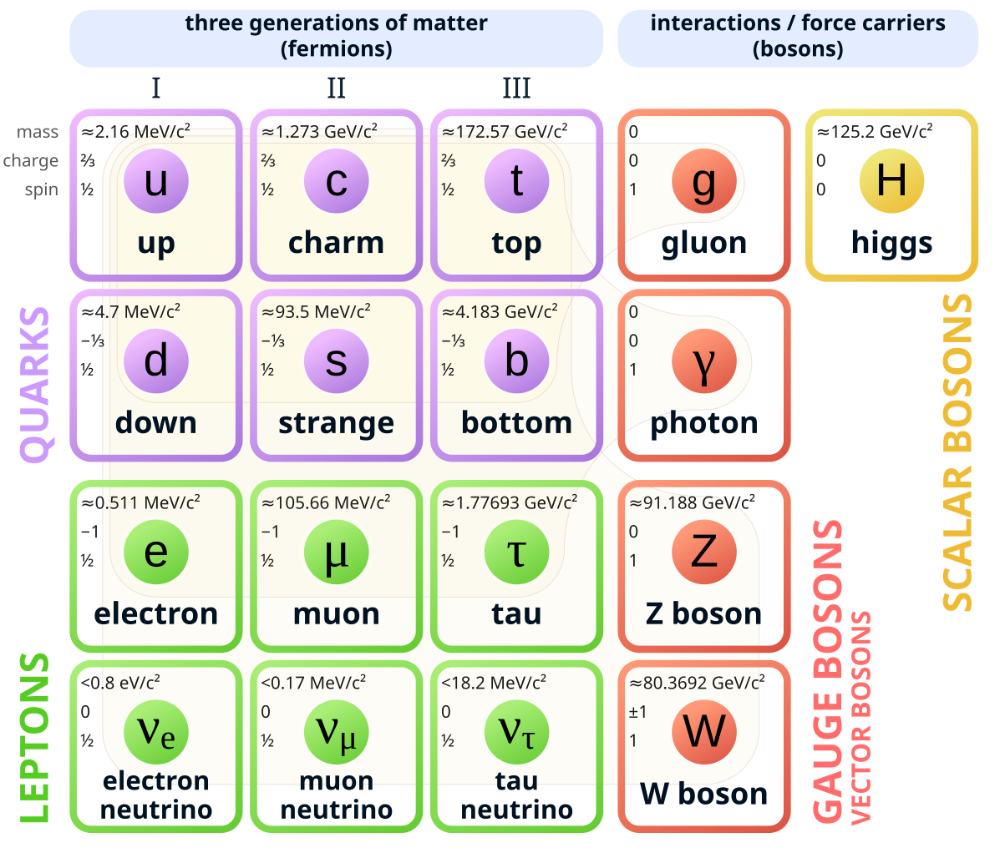

<header class="header">
  <a href="./post3.html" class="home-link">← back</a>
</header>

> _Young man, if I could remember the names of these particles, I would have been a botanist!_ - Enrico Fermi

## History
The Jains in the Indian subcontinent around 9th century BC had the concept of 'parmanu' (परमाणु) which is essentially sanskrit and means indivisible, indestructible and eternal. The ancient Greeks around 5th century BC gave us the word atomon (ἄτομον) which too means indivisible and uncuttable. John Dalton the British physicist lay the foundation for the modern concept of atoms in the 19th century. Finally in 1897 another British physicst J J Thmompson discovered the electron. This is the particle which is of interest to us and most of us recall this from our school days.

But where does the electron come from? How does it get a negative charge? What even is charge?

## The Standard Model
In early 20th century British physicist Paul Dirac gave the world his Dirac's equation . This equation is considered the seed of modern physics as we know it today. Over the next 50 odd years this Standard Model grew to describe three of the four known fundamental forces (electromagnetic force, weak, and strong interactions but not gravity). This model consists of of all the particles which we know to exist in our universe through various permutations and combinations of 'Elementary Particles'. Our humble electron is one of these Elementary Particles. There are two types of Elementary Particles - Fermions and Bosons (Italian Enrico Fermi and Indian Satyendra Nath Bose). Fermions are further divided into Quarks and Leptons. Bosons are divided into two categories - the vector category is called Gauge Bosons and the scalar category is called Higgs Boson. In total there are 12 Fermions and 5 Bosons. Owing to certain properties there are further combinations of these Elementary Particles. The total number turns out to be 48 Fermions an 13 Bosons. At a school level we just know of one Elementary Particle and that is the electron (protons and neutrons are composite particles and not elementary particles). Below is a diagram courtesy Wikipedia.

{.responsive-img}

## Electron and the Electron Field

<footer class="footer">
  <a href="./post3.html" class="home-link">← back</a>
</footer>
