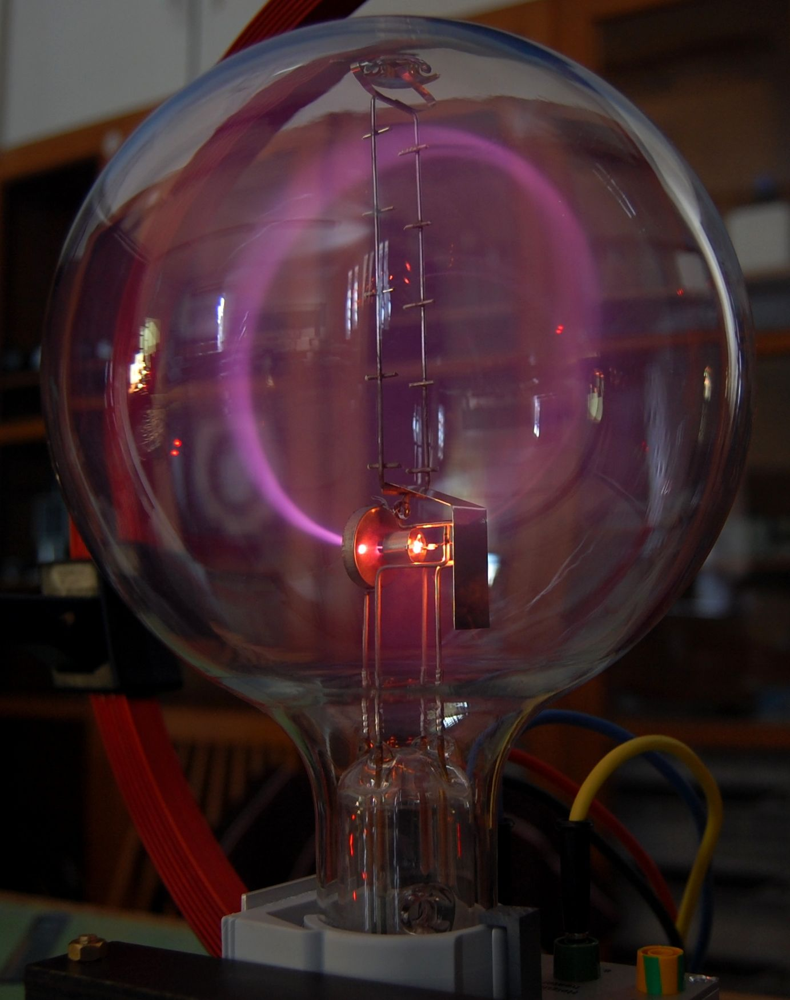

<header class="header">
  <a href="./post3.html" class="home-link">← back</a>
</header>

> _Young man, if I could remember the names of these particles, I would have been a botanist!_ - Enrico Fermi

## History
The Jains in the Indian subcontinent around 9th century BC had the concept of 'parmanu' (परमाणु) which in Sanskrit means indivisible, indestructible and eternal. The ancient Greeks around 5th century BC gave us the word atomon (ἄτομον) which too means indivisible and uncuttable. John Dalton the British physicist lay the foundation for the modern concept of atoms in the 19th century. Finally in 1897 another British physicist J J Thmompson discovered the electron. This is the particle which is of interest to us and most of us recall it from our school days.

## The Standard Model
In early 20th century British physicist Paul Dirac gave the world his Dirac's equation. This equation is considered to be the seed of modern physics as we know it today. Over the next 50 odd years this Standard Model grew to describe three of the four known fundamental forces (electromagnetic force, weak, and strong interactions but not gravity). This model consists of of all the particles which we know to exist in our universe through various permutations and combinations of 'Elementary Particles'. Our humble but mighty electron is one of these Elementary Particles. There are two types of Elementary Particles - Fermions and Bosons (named after Italian Enrico Fermi and Indian Satyendra Nath Bose). Fermions are further divided into Quarks and Leptons. Bosons too are divided into two categories - the vector category is called Gauge Bosons and the scalar category is called Higgs Boson. In total there are 12 Fermions and 5 Bosons. Owing to certain properties there are further combinations of these Elementary Particles possible. The total number turns out to be 61 composed of 48 Fermions an 13 Bosons. At the school level we just know of one Elementary Particle and that is the electron (protons and neutrons are composite particles and not elementary particles). Below is a diagram courtesy Wikipedia.

{.responsive-img}

## Electron and the Electric Field
The ancient Greeks had an idea of what charge is by rubbing amber against fur which in turn attracted things. Electron is an Elementary Particle as per the Standard Model and belongs to the Lepton family. It carries a negative electric charge. Electrons exhibit both particle and wave nature. When static the electron has a surrounding electric field and when it moves it produces a magnetic field too. This electric field is what actually attracts a positive charge and repels another negative charge.

Electrons are outside the nucleus of an atom. The outermost electrons are called valence electrons. These valence electrons are least tightly bound to the nucleus therefore they help in forming chemical bonds with other atoms resulting in other molecules or crystals. In some materials these valence electrons can move around freely leading to conduction as we call it. The moving electrons create the electric and magnetic field. This is the foundation of all electronics today.

### Elementary Charge
Electric charge is an outcome of the changes in symmetry of electric fields of elementary particles. A Lepton - an electron - exhibits an electric field and when it is rotated this electron field creates a force. This force is what charge is. By nomenclature, the American Benjamin Franklin gave us the negative and positive charge concepts. By default there is an inherent symmetry in the fields exhibited by these particles. If that symmetry is disturbed and transformed it exerts a force. This force is transferred as energy, thus actually charge can never be created nor destroyed, it is only transferred. Charge is an intrinsic property of varying the symmetry of fields of particles. Today we measure electric charge in the units called Coulombs named after the French physicist Charles-Augustin de Coulomb.

{.responsive-img}
<small> Image courtesy Wikipedia: A beam of electrons (cathode rays) in a vacuum tube bent into a circle by a magnetic field generated by a Helmholtz coil.</small>

<footer class="footer">
  <a href="./post3.html" class="home-link">← back</a>
</footer>
