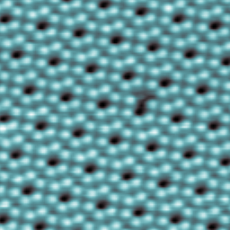

<header class="header">
  <a href="./post3.html" class="home-link">← back</a>
</header>

> _The interface is the device_ - Herbert Kroemer

## Lattice Structure
Every element in the periodic table has at least an electron in their atomic structure. Thus there is a potential for these electrons to move around and create an electric field (also a magnetic field). In common parlance we use the terms conductors and
insulators. Conductors are those elements which allow an electric current to flow through them, example copper which has an atomic number of 29. Sulfur with an atomic number of 16 is an insulator and it does not allow electric current to flow. Both have electrons
but only copper is able to conduct electricity. This is because of the way copper atoms are connected to each other. They allow valence electrons to move freely at normal conditions. To start this process of movement of electrons (and thereby create electric current) there has to a force, an energy difference. This is called voltage differential. So the two ends of a copper wire will immediately allow electrons to flow through if one end of the copper wire is at a 'higher energy' level than the other end. This tiny bit of energy required to create conduction (which is actually getting the valence electrons to move around) is technically referred to getting the electrons in an energy band called the conduction band. A side note: Almost all of the physics related posts is for conceptual understanding and not mathematical rigor. The inverse happens for Sulfur. The electrons in the valence shell under normal conditions are not able jump into this conduction band even if energy is supplied in terms of voltage difference. So no electric current flows. All this changes basis the conditions, for instance the temperature.

There is another class of elements in the periodic table called semi-conductors. Silicon is one of the most common elements available on Earth. At normal temperatures Silicon does not allow its electrons in its valence shell to reach teh conduction band. It takes around 1.1 eV (electron Volt is the unit for the energy) to make its valence electron move around. Silicon has 14 electrons and as per Bohr's model the distribution is $1s^2$ $2s^2$ $2p^6$ $3s^2$ $3p^2$. Thus the third orbit has 4 electrons. 4 electrons of one silicon atom forms covalent bonds with other silicon atoms. When the 1.1 eV is supplied one electron from this third orbit jumps off into the conduction band and moves freely creating electric current. But when the electron moves away it leaves a 'hole'. Some other electron from the neighboring silicon atom can jump and occupy this position. So in a way the hole is moving backwards and electrons are moving forward. That is the mental model.

  
   

<small>Diamond cubic crystal structure (Wikimedia)</small>

{.responsive-img}
<small>Silicon 111 courtesy Feenstra Group (Carnegie Mellon University)</small>

<footer class="footer">
  <a href="./post3.html" class="home-link">← back</a>
</footer>
