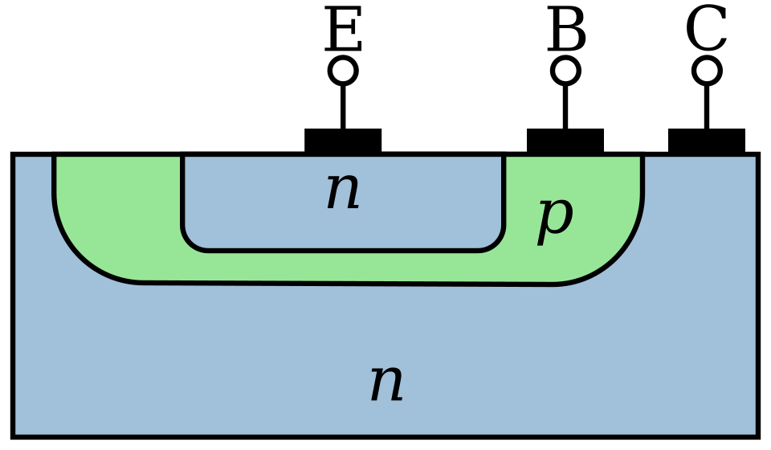

<header class="header">
  <a href="./post3.html" class="home-link">← back</a>
</header>

> _The invention of the transistor may be the most important invention of the 20th century._ - Gordon Moore

The Bipolar Junction Transistor (BJT) was invented in 1948 while the point contact transistor was invented in 1947. All these inventions happened at Bell Labs. Since the focus is to build a computer probably the only type of transistor which will be used is the BJT NPN transistor. 

## NPN Bipolar Junction Transistor

As the name suggests this type of transistor has a P-type doped silicon semiconductor sandwiched between two N-type doped silicon. It is referred to as bipolar because there are two PN Junctions in this device. 

{.responsive-img}

 <small>Simplified cross-section of an NPN BJT (Wikipedia)</small> 

### Construction of NPN BJT
There are three terminals in an NPN BJT, each connecting to the N, P, and N. They are called Emitter, Base, and Collector. The middle P-type is called the base. The base is very thin and extremely lightly doped of P-type. The collector is physically the largest part of the NPN BJT, it surrounds the entire transistor as shown in the simplified schematic below. It is called collector because it makes sure that the electrons which enter the base cannot escape without being collected. The emitter is heavily doped but smaller in physical dimension. The heavily doped emitter increases the emitter injection efficiency which is the ratio of carriers injected by emitter to those injected by the base.

{.responsive-img}

 <small>Simplified cross-section of an NPN BJT (Wikipedia)</small> 

## The PNP BJT Switch
The transistor works as a switch in principle. When no potential difference is applied the the two PN Junctions are in equilibrium and there is a large depletion zone where there is no conduction. The depletion zones are wide and there is no movement of electrons or holes.

<footer class="footer">
  <a href="./post3.html" class="home-link">← back</a>
</footer>
