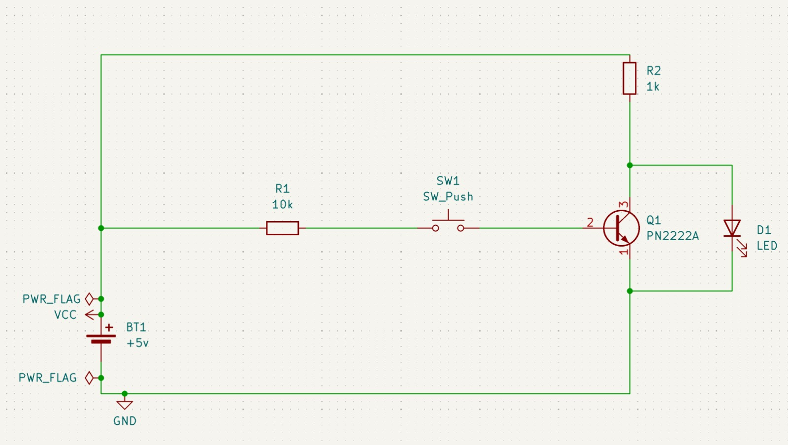

<header class="header">
  <a href="./post3.html" class="home-link">← back</a>
</header>

> _The invention of the transistor may be the most important invention of the 20th century._ - Gordon Moore

Starting from this section of my notepad on building a computer I can align each section with the Nand to Tetris Course. Actually I am using the book _The Elements of Computing Systems_ by the same professors. 

**Progress:** Completed Project 1 from the book. All material updated on my github [here](https://github.com/deepak-venkatesh/nand-to-tetris)

Some of the combinational logic gates I have built are documented below. 

## NOT Logic Gate
Also called the inverter simply converts a 0 to 1 and a 1 to 0. 

| IN | NOT |
|----|-----|
| 0  | 1   |
| 1  | 0   |

{.responsive-img}

 <small>1 Bit Not Logic Gate Circuit</small> 

  <iframe
    src="https://www.youtube.com/embed/HKwXmZ-kiXQ"
    title="NOT Gate"
    allow="accelerometer; autoplay; clipboard-write; encrypted-media; gyroscope; picture-in-picture; web-share"
    allowfullscreen>
  </iframe>

## AND Logic Gate
The truth table is below.

| A | B | AND |
|---|---|-----|
| 0 | 0 | 0   |
| 0 | 1 | 0   |
| 1 | 0 | 0   |
| 1 | 1 | 1   |

## OR Logic Gate
The truth table is below.

| A | B | OR |
|---|---|----|
| 0 | 0 | 0  |
| 0 | 1 | 1  |
| 1 | 0 | 1  |
| 1 | 1 | 1  |

## NOR Logic Gate
The truth table is below.

| A | B | NOR |
|---|---|-----|
| 0 | 0 | 1   |
| 0 | 1 | 0   |
| 1 | 0 | 0   |
| 1 | 1 | 0   |

## NAND Logic Gate
The truth table is below.

| A | B | NAND |
|---|---|------|
| 0 | 0 | 1    |
| 0 | 1 | 1    |
| 1 | 0 | 1    |
| 1 | 1 | 0    |

## XOR Logic Gate
The truth table is below. I used NAND gates to build the XOR gate.

| A | B | XOR |
|---|---|-----|
| 0 | 0 | 0   |
| 0 | 1 | 1   |
| 1 | 0 | 1   |
| 1 | 1 | 0   |

_Last Updated: 4 Oct 2026_

<footer class="footer">
  <a href="./post3.html" class="home-link">← back</a>
</footer>
